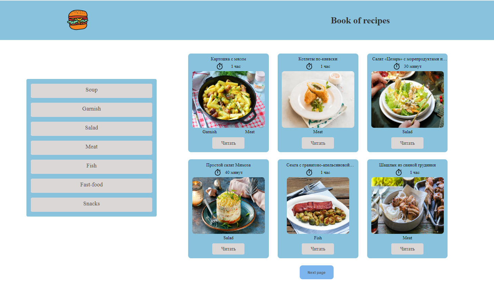

## Приложение Книга рецептов

---
### Django REST Framework + React JS





### Установка приложения
____


```
git clone https://github.com/molodcovnik/recipes_book.git
python3 -m venv venv
source venv\bin\activate
pip install -r requirements.txt
(venv): cd recipes
python manage.py runserver
```

Открываем еще один терминал

```
cd frontentd
npm install
npm build
npm start

```
### Админ панель
____

    логин: nik
    пароль: nik

### Просмотр API Документации по ссылке:


http://127.0.0.1:8000/api/schema/docs/